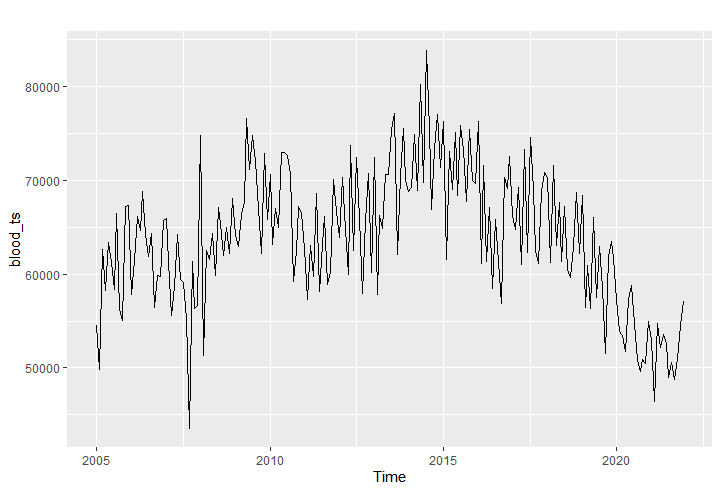

## R을 사용한
# 서울시 월별 헌혈 현황을 통한 시계열 분석 및 예측

 

다른 변수가 존재하지 않는 단순 월별 헌혈 현황 수 통계로  
**ETS 모형**, **ARIMA 모형**, **ARMA 오차 회귀모형**을 통해서만 예측 진행

 

## 데이터 설명

- 사용 데이터 : [서울시 헌혈현황(월별) 통계](http://data.seoul.go.kr/dataList/11001/S/2/datasetView.do)
- 2005년 1월부터 2021년 12월까지의 월별 헌혈 건수 실적 통계
- 동일인이 여러 차례를 실시해도 매회 실적으로 인정

